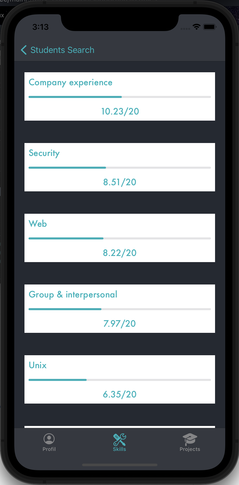

# Swifty Companion

``Ce projet a pour but de vous initier au développement d'application mobile. Il s'agit de réaliser, une application qui permet de récupérer les informations des élèves de 42, en utilisant l’API de l'intranet de 42.``

### Stack

*  Swift 5
* Alamofire 5.4
* Swift Keychain Wrapper 4.0
